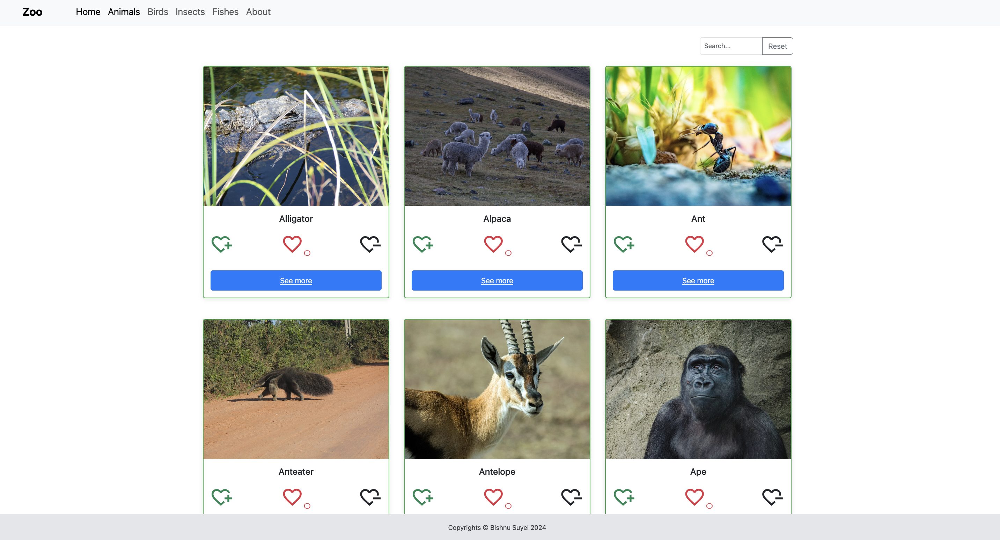
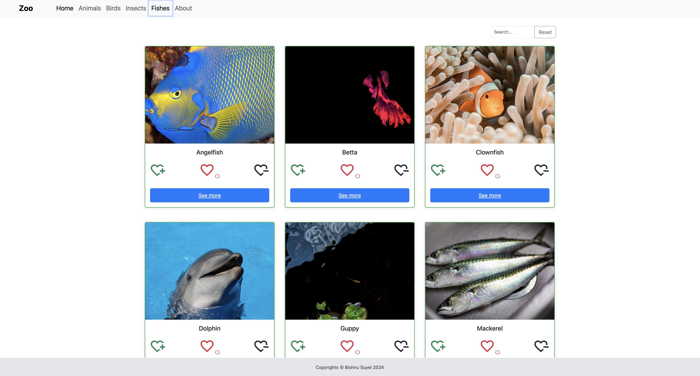
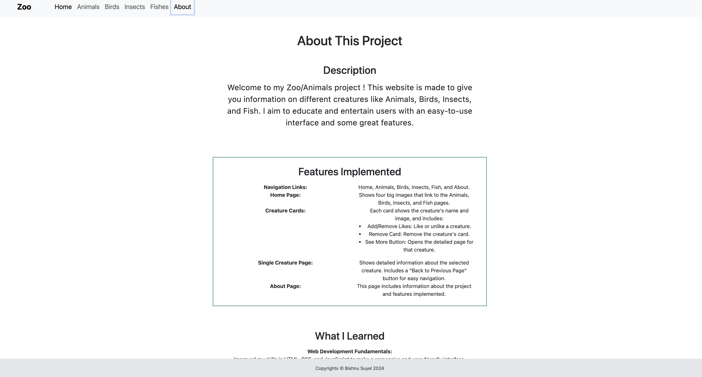

# Zoo/Animals


## Project Description: Zoo Application
This is a ReactJS project designed to showcase various zoo creatures, leveraging both local data and the Unsplash API for images. Users can explore information about a wide range of wildlife and pet creatures, including animals, birds, insects, and fishes.

## Features:
- Categorical Search: Users can find creatures based on specific categories.
- Interactive Elements: Users can increase or decrease likes using plus and minus heart symbols.
- Search Functionality: A search bar allows users to look up specific creatures by name.
- Card Removal: Users can remove creature cards from the display by clicking the cross symbol located at the top right of each card.

## Technologies used
Built with:

 - HTML  

 - JS  

 - CSS  

 - Reactjs    

 ## Getting Started

### Prerequisites

- Node.js
- npm

### Installation

1. Clone the repository:

   ```bash
   git clone https://github.com/bishnu-suyel/animals
   ```

2. Navigate to the project directory:

    ```bash
    cd animals
    ```
3. Install dependencies:

    ```bash
    npm install
    ```
4. Create an Unsplash API Key:

    - Go to Unsplash Developers.
    - Sign up or log in to your account.
    - Create a new application to get your API key.
    Set your API key:

5. Create a .env file in the root of your project and add your API key:
    - VITE_UNSPLASH_API_KEY=your_api_key_here

4. To start development server:

    ```bash
    npm run dev
    ``` 

## Live Page   

Live page: https://ornate-lily-428df6.netlify.app/

## Screenshot
Here are some screenshots of the application:

| Home Page            | Animals Page                |
|--------------------------|--------------------------|
|  |  |

| Fishes Page           | About Page      |
|--------------------------|--------------------------|
|  |  |

## Sources  

 - [GitHub Guides - masterin markdown](https://guides.github.com/features/mastering-markdown/)
 - [Make a README](https://www.makeareadme.com/)
 - [React Documentation](https://react.dev/learn)
 - [Unsplash API Documentation](https://unsplash.com/documentation)

## Acknowledgement  
 - [Margit Tennosaar](https://github.com/margittennosaar)

## Author
 - [GitHub @bishnu-suyel](https://github.com/bishnu-suyel)
 - [LinkedIn @bishnu-suyel](https://www.linkedin.com/in/bishnu-suyel)
